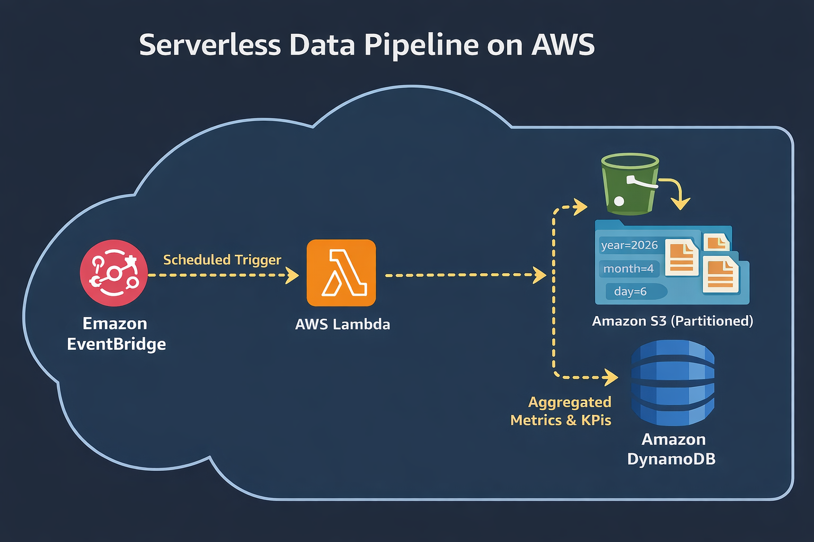

# 🚀 Serverless Data Pipeline on AWS

## 📌 Overview

This project demonstrates a fully serverless data pipeline using AWS services to process and analyze data.

---

## 🧱 Architecture

EventBridge → Lambda → S3 (partitioned) → DynamoDB

---

## ⚙️ Tech Stack

* AWS Lambda
* Amazon S3
* Amazon DynamoDB
* Amazon EventBridge

---

## 🔄 Features

* Serverless ETL processing
* Scheduled execution using EventBridge
* Partitioned data storage in S3
* KPI storage in DynamoDB
* NDJSON data handling

---

## 📂 Project Structure

* `lambda/` → Lambda function code
* `data/` → Sample input data
* `architecture/` → Architecture diagram
* `screenshots/` → Output proof

---

## 📊 Output

* Partitioned data in S3
* Metrics stored in DynamoDB

---

## 💡 Key Learnings

* Built event-driven serverless pipelines
* Handled real-world data formats (NDJSON)
* Implemented IAM-based security
* Designed scalable architecture

---

## 🚀 Future Enhancements

* Athena integration
* Dashboard visualization
* Data quality checks

---

## 👨‍💻 Author

Livin Vincent
